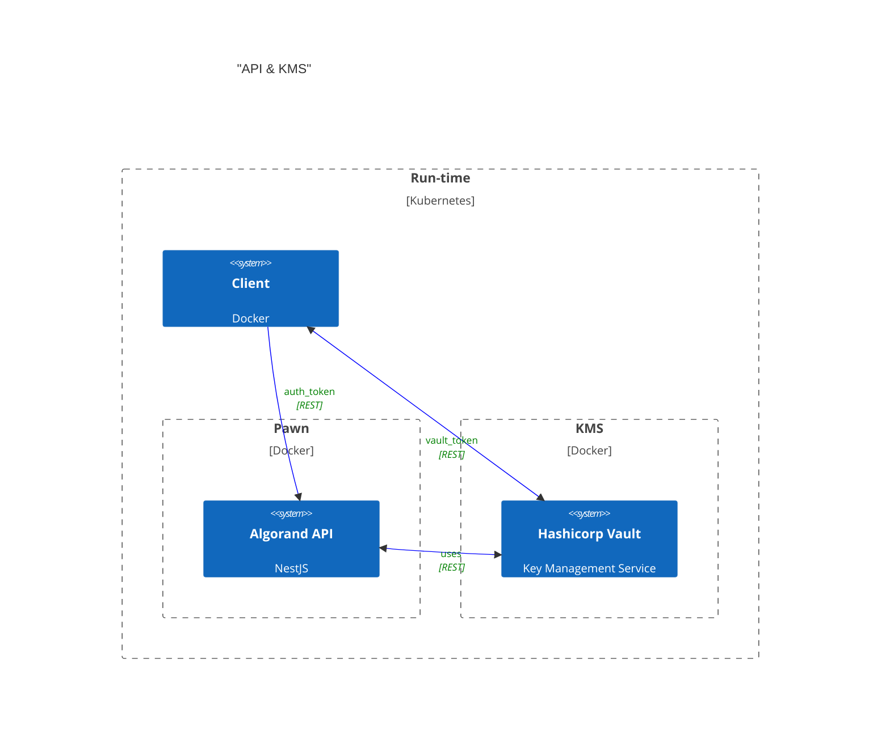
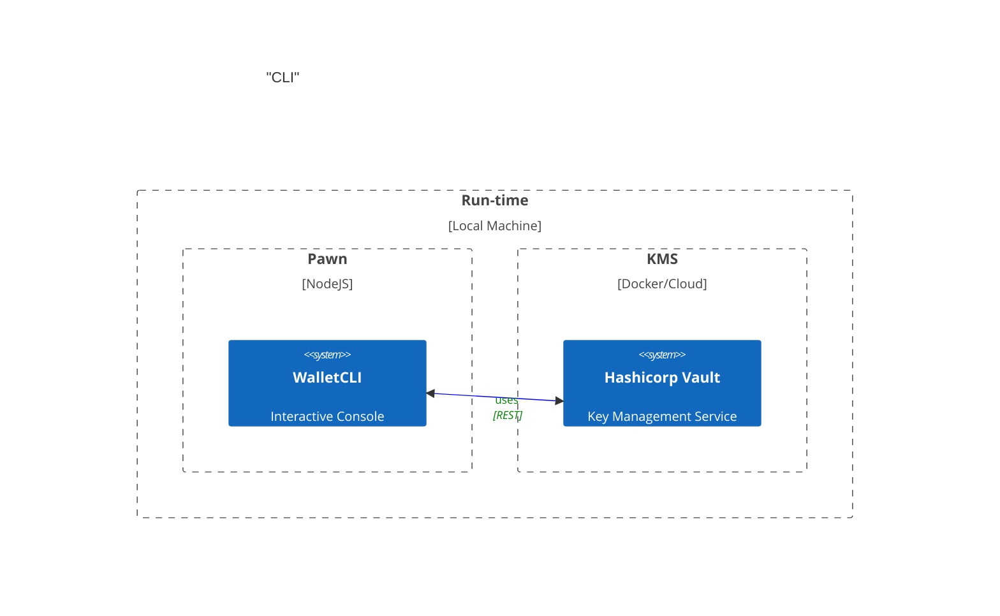

# Murakami

Murakami uses a traditional KMS (Key Management Service) to manage the keys for Algorand transaction signing and integration. In this specific case, we are using Hashicorp Vault as the KMS.

## For whom is this?

This is primarily for startups, enterprise companies that have strict security policies and requirements for key management. Traditional web3 custody can be expensive and overly complex for most use cases. This is a simple and easy to use solution that can be used by anyone who wants to manage their keys in a secure and compliant way.
## Conceptual Architecture

This pattern ensure that applications comply with the principle of **ISOLATION** between appliation space and "trusted" space; i.e the KMS.
Most web3 applications handle cryptographic keys in-memory and in the same run-time space as the application. This is a security risk as the keys can be easily compromised by an attacker who gains access to the application's memory space.

This ensures that if the application is compromised, the keys are still secure and cannot be accessed by the attacker.

### Integration

Integration expects the client to use REST to communicate and request actions such as creating assets, transferring assets, etc. The client will send a request to the application, which will then forward the request to the KMS for key gen and signing.



### Access Control Policy

This is mostly defined by Hashicorp Vault. The application will use the `approle` authentication method to authenticate with the KMS. Meaning that different roles will have access to different keys.

For most information, you can refer to the [Hashicorp Vault ACL documentation](https://www.vaultproject.io/docs/auth/approle).

### Device Attestation & Credential Issuance

Pawn provides generic OID4VC (OpenID for Verifiable Credential Issuance) tools. It does **not** provide a built-in device attestation endpoint, as attestation requirements (e.g., Apple App Attest, Google Play Integrity) vary significantly between platforms and applications.

Downstream consumers (managers) are responsible for:
1.  Verifying the device integrity or user identity out-of-band.
2.  Using the `/v1/credential/issuer/offers` endpoint to create a pre-authorized credential offer for the user's `did:key`.
3.  Distributing the offer URI/QR code to the user's wallet.

Once the user's wallet redeems the credential, it can be used to authenticate subsequent requests to Pawn (e.g., for `did:algo` deployment) via the `CredentialAuthGuard`.


# Setup Development Environment

## Build and run docker
```bash
docker compose up -d vault pawn;
```

Now you can open to see endpoint documentation at http://localhost:3000/docs/

> **Note**: The raw OpenAPI JSON spec is dynamically generated and available at http://localhost:3000/docs-json.

But before you can use the API, you need to unseal vault and / or set up the vault keys, if they are not already set up

> **Note**: If you make any changes to the `.env` file, you must redeploy the application for the changes to take effect. You can do this by running:

```bash
docker compose down pawn
docker compose up -d pawn
```

## Setup Vault Keys

Go inside the pawn container with:

```bash
docker exec -it pawn ash
```

And run the following command:

```bash
yarn run vault:development:init
```

This will unseal vault and get tokens. If you are running this for the first time, it will also create users, setup hashicorp's transit engines, setup access policies for the different roles, and create the vault keys.
Note that, every time you restart the vault container, you need to unseal, which means you need to run this command.
This command's output will provide you 4 important pieces of information:

1) Vault Root Token
2) Token for "pawn_managers_approle"
3) Token for "pawn_users_approle"
4) Manager's public Algorand address
5) Make sure Manager's address has enough ALGO for usage OR to run integration tests. You can use https://bank.testnet.algorand.network/ to dispense some ALGO.

You can re-run `vault:development:init` whenever you want.

## HTTP API mode

All application endpoints are served under the `/v1` global prefix on
`http://localhost:3000`. The interactive Swagger UI lives at
http://localhost:3000/docs/ and the raw OpenAPI spec at
http://localhost:3000/docs-json. The curl examples below assume:

```bash
export PAWN=http://localhost:3000/v1
export VAULT=http://localhost:8200/v1
```

The examples pipe responses through [`jq`](https://jqlang.github.io/jq/)
for readability — it is optional.

### Authentication (during development)

Authentication is a two-step exchange: log in to Vault with an AppRole
`role_id`/`secret_id` to get a Vault `client_token`, then trade that
token for a Pawn `access_token` (JWT) at the sign-in endpoint. Every
protected endpoint expects the JWT in the `Authorization: Bearer` header.

```bash
# 1. Copy the role_id / secret_id printed by `vault:development:init`
#    (from `pawn_managers_approle` for manager scope, or
#     `pawn_users_approle` for user scope).
export ROLE_ID=3ab5dada-ec1d-34a6-19ed-d63c9f6eba9c
export SECRET_ID=e857e495-48b2-ab69-3cd1-99f6fe44ccc1

# 2. Log in to Vault and capture the client_token.
export VAULT_TOKEN=$(curl -s -X POST "$VAULT/auth/approle/login" \
  -H 'Content-Type: application/json' \
  -d "{\"role_id\":\"$ROLE_ID\",\"secret_id\":\"$SECRET_ID\"}" \
  | jq -r '.auth.client_token')

# 3. Exchange the Vault token for a Pawn access_token (JWT).
export TOKEN=$(curl -s -X POST "$PAWN/auth/sign-in/" \
  -H 'Content-Type: application/json' \
  -d "{\"vault_token\":\"$VAULT_TOKEN\"}" \
  | jq -r '.access_token')

echo "$TOKEN"
```

Now pass `-H "Authorization: Bearer $TOKEN"` on every call below.

# API Reference (curl)

> The role you authenticated as (`pawn_managers_approle` vs
> `pawn_users_approle`) determines which Vault transit keys you can
> reach. Manager-scoped operations (create asset, clawback, deploy
> manager identity, list DID identities) require a manager token.

## Wallet — users

### Create a user

Provisions a Vault transit Ed25519 key for the user and returns its
derived Algorand address. No DID is published at creation time.

```bash
curl -s -X POST "$PAWN/wallet/user/" \
  -H "Authorization: Bearer $TOKEN" \
  -H 'Content-Type: application/json' \
  -d '{"user_id":"1234"}'
```

### List users

```bash
curl -s "$PAWN/wallet/users/" -H "Authorization: Bearer $TOKEN"
```

### Get a single user

```bash
curl -s "$PAWN/wallet/users/1234/" -H "Authorization: Bearer $TOKEN"
```

### Get a user's asset holdings

```bash
curl -s "$PAWN/wallet/assets/1234" -H "Authorization: Bearer $TOKEN"
```

### Export a user's raw private key

> [!WARNING]
> Exporting a private key removes Vault's isolation guarantee for that
> key: once exported, the raw key material exists outside of Vault and
> Murakami can no longer protect it. Only enable this for users/flows
> that genuinely need a self-custody export (e.g. "back up my wallet"),
> and treat the response as highly sensitive (do not log it, store it
> encrypted, transmit only over TLS).
>
> Keys created **before** this feature was enabled are not exportable —
> Vault's `exportable` flag is set at key-creation time and cannot be
> changed retroactively. Only users created after this change can use
> this endpoint.

As a confirmation step (similar to re-entering a password), the caller
must re-submit a valid Vault AppRole `role_id`/`secret_id` pair in the
request body — the same credentials used during sign-in. These are
re-verified against Vault before the key is exported.

```bash
curl -s -X POST "$PAWN/wallet/users/1234/export" \
  -H "Authorization: Bearer $TOKEN" \
  -H 'Content-Type: application/json' \
  -d "{\"role_id\":\"$ROLE_ID\",\"secret_id\":\"$SECRET_ID\"}"
```

Response:

```json
{
  "user_id": "1234",
  "public_address": "I3345FUQQ2GRBHFZQPLYQQX5HJMMRZMABCHRLWV6RCJYC6OO4MOLEUBEGU",
  "key_version": "1",
  "private_key": "gA2k3...base64...=="
}
```

`private_key` is the raw ed25519 private key, base64-encoded, as
returned by Vault's transit `export/signing-key` endpoint.

## Wallet — manager

### Get manager details

Returns the manager's Algorand `public_address` (fund this address to
run transactions / integration tests).

```bash
curl -s "$PAWN/wallet/manager/" -H "Authorization: Bearer $TOKEN"
```

### Get the manager issuer identity (`did:algo`)

Resolves the manager's issuer `did:algo` and its DID Document — the
platform root of trust for credential issuance. Returns `404` when no
`DIDAlgoStorage` contract has been deployed yet.

```bash
curl -s "$PAWN/wallet/manager/identity" -H "Authorization: Bearer $TOKEN"
```

### Deploy (or redeploy) the manager identity

Deploys a fresh `DIDAlgoStorage` contract with the manager Vault key and
publishes the manager's issuer `did:algo`. The app id is persisted to
Vault KV at `secret/murakami/manager/app-id`. Fails with `409` when a
contract is already configured — pass `{"force": true}` to redeploy in
place (key rotation), which reclaims the old document box MBR.

```bash
# First-time deploy
curl -s -X POST "$PAWN/wallet/manager/identity" \
  -H "Authorization: Bearer $TOKEN" \
  -H 'Content-Type: application/json' \
  -d '{}'

# Force redeploy / key rotation
curl -s -X POST "$PAWN/wallet/manager/identity" \
  -H "Authorization: Bearer $TOKEN" \
  -H 'Content-Type: application/json' \
  -d '{"force": true}'
```

## Wallet — transactions

Each transaction endpoint signs with the relevant Vault transit key and
broadcasts to the configured Algorand node, returning the resulting
`transaction_id` (group endpoints return a `group_id`).

### Create an asset (manager)

```bash
curl -s -X POST "$PAWN/wallet/transactions/create-asset/" \
  -H "Authorization: Bearer $TOKEN" \
  -H 'Content-Type: application/json' \
  -d '{
    "total": 31415,
    "decimals": 2,
    "defaultFrozen": false,
    "unitName": "TEST",
    "assetName": "Test Asset",
    "url": "https://example.com"
  }'
```

`managerAddress`, `reserveAddress`, `freezeAddress`, and
`clawbackAddress` are optional. Set `clawbackAddress` to the manager
address if you want to be able to claw the asset back later.

### Transfer an asset (manager → user)

```bash
curl -s -X POST "$PAWN/wallet/transactions/transfer-asset/" \
  -H "Authorization: Bearer $TOKEN" \
  -H 'Content-Type: application/json' \
  -d '{
    "assetId": 1234567890,
    "userId": "1234",
    "amount": 10
  }'
```

`lease` (32-byte base64) and `note` (≤1000 chars, public) are optional
on all transfer/clawback calls.

### Transfer Algos

`fromUserId` may be a user id or the manager; `toAddress` is any
Algorand address.

```bash
curl -s -X POST "$PAWN/wallet/transactions/transfer-algo/" \
  -H "Authorization: Bearer $TOKEN" \
  -H 'Content-Type: application/json' \
  -d '{
    "fromUserId": "1234",
    "toAddress": "I3345FUQQ2GRBHFZQPLYQQX5HJMMRZMABCHRLWV6RCJYC6OO4MOLEUBEGU",
    "amount": 10
  }'
```

### Clawback an asset (manager)

Requires the asset to have been created with the manager as the
clawback address.

```bash
curl -s -X POST "$PAWN/wallet/transactions/clawback-asset/" \
  -H "Authorization: Bearer $TOKEN" \
  -H 'Content-Type: application/json' \
  -d '{
    "assetId": 1234567890,
    "userId": "1234",
    "amount": 10
  }'
```

### Application call / group transaction

`POST /v1/wallet/transactions/app-call/` and
`POST /v1/wallet/transactions/group-transaction/` accept the richer
shapes defined in `src/wallet/app-call-request.dto.ts` and
`src/wallet/group-request.dto.ts` respectively. See the Swagger UI at
`/docs/` for the full, current request schema.

## DID — per-user `did:algo` registry

These endpoints split authentication deliberately (see `SEQUENCE.md` for
the full flow diagrams):

- **`GET /v1/did/identities*`** — manager-authenticated (`Authorization: Bearer $TOKEN`).
- **`POST /v1/did/{create,update}/{transactions,submit}`** — driven by the
  wallet and gated by `CredentialAuthGuard`. The caller presents a
  device-attestation SD-JWT VC in the `X-Credential-Presentation` header;
  the bound `did:key` (from the credential's `cnf.kid`) identifies which
  contract to act on, so these routes take no `Authorization` JWT.

### List all per-user `did:algo` entries (manager)

```bash
curl -s "$PAWN/did/identities" -H "Authorization: Bearer $TOKEN"
```

### Resolve a single entry by `did:key` (manager)

```bash
curl -s "$PAWN/did/identities/did:key:z6Mkp..." \
  -H "Authorization: Bearer $TOKEN"
```

### Build / submit a wallet-owned contract deploy (wallet)

The build step returns an unsigned 3-txn atomic group with
`indexesToSign: [2]`; the wallet signs position 2 with its `did:key` and
posts the result back to the submit step.

```bash
export CRED='<compact SD-JWT VC presentation>'

# Build the deploy group
curl -s -X POST "$PAWN/did/create/transactions" \
  -H "X-Credential-Presentation: $CRED" \
  -H 'Content-Type: application/json' \
  -d '{}'

# Submit the wallet-signed group
curl -s -X POST "$PAWN/did/create/submit" \
  -H "X-Credential-Presentation: $CRED" \
  -H 'Content-Type: application/json' \
  -d '{"signedTxns": ["<base64 signed txn>", "..."]}'
```

### Build / submit a DID-document update (wallet)

The supplied `document.id` must equal the canonical `did:algo` derived
from the credential-bound `did:key`.

```bash
# Build the update groups
curl -s -X POST "$PAWN/did/update/transactions" \
  -H "X-Credential-Presentation: $CRED" \
  -H 'Content-Type: application/json' \
  -d '{"document": {"id": "did:algo:dockernet:app:1002:9a2c…", "service": []}}'

# Submit the signed groups
curl -s -X POST "$PAWN/did/update/submit" \
  -H "X-Credential-Presentation: $CRED" \
  -H 'Content-Type: application/json' \
  -d '{"groups": [ ... ]}'
```

## Credentials — OID4VCI issuance & OID4VP verification

App-level orchestration routes under `/v1/credential/{issuer,verifier}/*`
are manager-authenticated. The underlying OID4VCI / OID4VP protocol
routes (token, credential, authorization) are mounted by the Credo agent
under `/oid4vci` / `/oid4vp` and are exercised by the wallet, not by
these helpers. See `SEQUENCE.md` sections 3–4 for the end-to-end flow.

### List credential configurations

```bash
curl -s "$PAWN/credential/issuer/configurations" \
  -H "Authorization: Bearer $TOKEN"
```

### Add / remove a dynamic credential configuration

```bash
curl -s -X POST "$PAWN/credential/issuer/configurations/my-custom-credential" \
  -H "Authorization: Bearer $TOKEN" \
  -H 'Content-Type: application/json' \
  -d '{
    "format": "vc+sd-jwt",
    "vct": "my-custom-credential",
    "cryptographic_binding_methods_supported": ["did:key"],
    "credential_signing_alg_values_supported": ["EdDSA"]
  }'

curl -s -X DELETE "$PAWN/credential/issuer/configurations/my-custom-credential" \
  -H "Authorization: Bearer $TOKEN"
```

### Create a pre-authorized credential offer

Pinned to a wallet-local `did:key`. The `credentialOffer` in the
response (`openid-credential-offer://...`) is what you render as a QR
code for the wallet.

```bash
curl -s -X POST "$PAWN/credential/issuer/offers" \
  -H "Authorization: Bearer $TOKEN" \
  -H 'Content-Type: application/json' \
  -d '{
    "credentialConfigurationIds": ["device-attestation-credential"],
    "holderDidKey": "did:key:z6MkpTHR8VNsBxYAAWHut2Geadd9jSwuBV8xRoAnwWsdvktH",
    "issuanceMetadata": {"rewardTier": "gold"}
  }'
```

### Inspect issuance sessions

```bash
curl -s "$PAWN/credential/issuer/sessions" -H "Authorization: Bearer $TOKEN"
curl -s "$PAWN/credential/issuer/sessions/<session-id>" -H "Authorization: Bearer $TOKEN"
```

### Create an OID4VP presentation request

The `authorizationRequest` in the response (`openid4vp://...`) is
rendered as a QR code for the wallet.

```bash
curl -s -X POST "$PAWN/credential/verifier/requests" \
  -H "Authorization: Bearer $TOKEN" \
  -H 'Content-Type: application/json' \
  -d '{
    "presentationDefinition": {
      "id": "rewards-eligibility",
      "input_descriptors": [
        {
          "id": "device-attestation-credential",
          "format": {"vc+sd-jwt": {"sd-jwt_alg_values": ["EdDSA"]}},
          "constraints": {
            "fields": [
              {"path": ["$.vct"], "filter": {"type": "string", "const": "device-attestation-credential"}}
            ]
          }
        }
      ]
    }
  }'
```

### Inspect verification sessions

```bash
curl -s "$PAWN/credential/verifier/sessions" -H "Authorization: Bearer $TOKEN"
curl -s "$PAWN/credential/verifier/sessions/<session-id>" -H "Authorization: Bearer $TOKEN"
```

# CLI mode
Pawn also supports a CLI mode, in which you can use for a personal wallet and tool. 



### How to run the CLI

1) Make sure you have ran `yarn` to install dependencies.
2) Check the .env file and changes the `VAULT_ROLE_ID` and `VAULT_SECRET_ID` to the ones you obtained from `pawn_managers_approle` or `pawn_users_approle`.

    2.1) __If your vault is deployed remotely, you need to change the `CLI_USE_LOCAL_VAULT` to `false` and set the `VAULT_BASE_URL` to your remote vault address.__
    
3) Run the CLI command:

```
yarn run start:dev -- --entryFile repl
```

4) You should see a prompt like this:

```ts
[9:40:07 PM] Starting compilation in watch mode...

[9:40:10 PM] Found 0 errors. Watching for file changes.

[Nest] 102986  - 04/06/2025, 9:40:11 PM     LOG [NestFactory] Starting Nest application...
[Nest] 102986  - 04/06/2025, 9:40:11 PM     LOG [InstanceLoader] HttpModule dependencies initialized
[Nest] 102986  - 04/06/2025, 9:40:11 PM     LOG [InstanceLoader] ConfigHostModule dependencies initialized
[Nest] 102986  - 04/06/2025, 9:40:11 PM     LOG [InstanceLoader] ConfigModule dependencies initialized
[Nest] 102986  - 04/06/2025, 9:40:11 PM     LOG [InstanceLoader] ChainModule dependencies initialized
[Nest] 102986  - 04/06/2025, 9:40:11 PM     LOG [InstanceLoader] VaultModule dependencies initialized
[Nest] 102986  - 04/06/2025, 9:40:11 PM     LOG [InstanceLoader] JwtModule dependencies initialized
[Nest] 102986  - 04/06/2025, 9:40:11 PM     LOG [InstanceLoader] AuthModule dependencies initialized
[Nest] 102986  - 04/06/2025, 9:40:11 PM     LOG [InstanceLoader] WalletCLIModule dependencies initialized
[Nest] 102986  - 04/06/2025, 9:40:11 PM     LOG REPL initialized
> 
```

### Sample commands

`Note`: _The following commands assume the authenticated user is of role **manager**. If you want to test as a less permissioned **user**, you need to change the `VAULT_ROLE_ID` and `VAULT_SECRET_ID` in the `.env` file to the ones you obtained from `pawn_users_approle`. Also, the calls `getAddress` and `sign` will require you to manually pass the specific KeyName and vaultKeyPath. See `wallet.cli.controller.ts` for more details._

1) **Fetch the WalletCLI object instance in console**
```ts
wallet = get(WalletCLI)
```

2) **Login to the vault, using the `VAULT_ROLE_ID` and `VAULT_SECRET_ID` from the `.env` file.**


```ts
await wallet.login(process.env.VAULT_ROLE_ID, process.env.VAULT_SECRET_ID, process.env.VAULT_TRANSIT_MANAGERS_PATH)
```

`login` also requires you to provide a valid path to the vault transit key. This is the path where the vault will store the keys for signing. Some roles might not have access to the transit key, so make sure you have access to the path.

3) **Fetch the address for the authenticated user**
```ts
// Get the wallet address and last round
addr = await wallet.getAddress()
```

To display the value of `addr`, simply type `addr` in the console.

4) **Get the last round from the connected node**

```ts
// Get the last round of the wallet
lastRound = await wallet.getLastRound()
```
To change the node you are connected to, you can change the value of `NODE_HOST` in the `.env` file. The default value is `testnet-api.algonode.cloud`.

5) **Fetch instance of Crafter to help craft txns**
```ts
// Get crafter
crafter = wallet.craft()
```
Crafter is a helper class that helps you craft transactions, for each transaction type, you make use of the [Builder Pattern](https://en.wikipedia.org/wiki/Builder_pattern) to build the transaction. The `get()` method returns the transaction object, and the `encode()` method encodes the transaction to be signed.

6) **Create a transaction to pay 10000 microalgos to the wallet address**

```ts
encoded = crafter.pay(10000, addr, addr).addFirstValidRound(lastRound).addLastValidRound(lastRound + 1000n).get().encode()
```

To display the value of `encoded`, simply type `encoded` in the console. You can use any typescript available tools and libraries to help you validate what needs to be signed. 

_Helper methods will be added in the future to help you validate the paylaod of what is to be signed_


7) **Sign the transaction with the wallet**

```ts
sig = await wallet.sign(encoded)
```

8) **Attach the signature to the encoded contents**
```ts
ready = crafter.addSignature(encoded, sig)
```

9) Submit the transaction to the network
```ts
await wallet.submitTransaction(ready)
```

# TESTING

## Unit Tests

``` shell
$ yarn 
$ yarn test
```

## Integration Tests

1) Adding some ALGO to manager:

If your manager address does not have enough ALGO, you need to add some ALGO to run integration tests.

You should have seen the manager address in the `Setup Vault Keys` step.
You can also find the manager address using the `/v1/wallet/manager/` endpoint. You need the manager's `access_token` (see [Authentication](#authentication-during-development)).
```bash
curl -s "$PAWN/wallet/manager/" -H "Authorization: Bearer $TOKEN"
```

You can use https://bank.testnet.algorand.network/ to dispense some ALGO.

2) Run tests:

```
yarn test:e2e
```


# Fresh Restart

Since there are vault volumes and side effects of the `vault:development:init` process, if you need a fresh restart, you might want to remove volumes and side effects.

```
sudo rm -rf volumes node_modules dist data;
sudo rm vault-seal-keys.json package-lock.json manager-role-and-secrets.json user-role-and-secrets.json;
```
# SECURITY

It's important to understand that Murakami does **NOT** manage security for you. The integrator is responsible for securing the vault's instance, managing access policies or handling of any admin tokens.

Hashicorp Vault has a lot of documentation on how to secure and configure your access policies. You can refer to the [Hashicorp Vault Security documentation](https://www.vaultproject.io/docs/security) or [Hashicorp Vault Access Policies documentation](https://www.vaultproject.io/docs/concepts/policies) for more information.

## User and Manager keys path

Murakami uses two different paths for storing keys in vault. One for users and one for managers. These values are defined in the `.env` file as `VAULT_TRANSIT_USERS_PATH` and `VAULT_TRANSIT_MANAGERS_PATH`. Please configure these paths according to your security policies. 

When creating and access keys Murakami will append to those paths `/keys/{keyName}`. 

## Exportable keys

All keys created via `VaultService.transitCreateKey` (user and manager
keys) are now created with `exportable: true` and
`allow_plaintext_backup: true`. This is **required** for the
`POST /v1/wallet/users/{user_id}/export` endpoint (see "Exporting a
user's private key" above) to work, but it is a deliberate weakening of
Murakami's default isolation guarantee: anyone holding a valid
manager/user Vault token (plus the AppRole `role_id`/`secret_id`
confirmation) can extract the raw private key for that key name.

If your deployment does not need self-custody export, remove
`exportable`/`allow_plaintext_backup` from `transitCreateKey` (or set
them to `false`) and do not mount the export endpoint — Vault enforces
this at key-creation time and it cannot be changed for existing keys.

## Vault Configuration and Root token

Although Murakami provides a development script to initialize vault, unseal and configure access policies, it's important to understand that this is only for development purposes. You can read the file `vault/development-init.ts` to see what actions are being performed and take that as reference for your own vault configuration.

In production, you should follow Hashicorp Vault's best practices for securing and configuring your vault instance.
