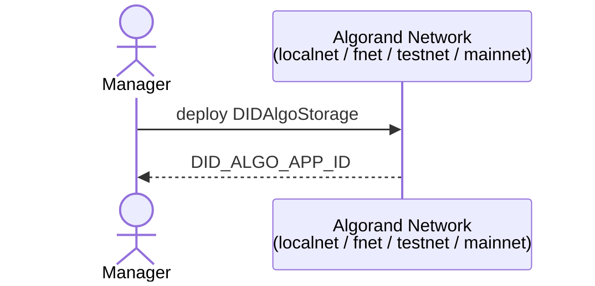
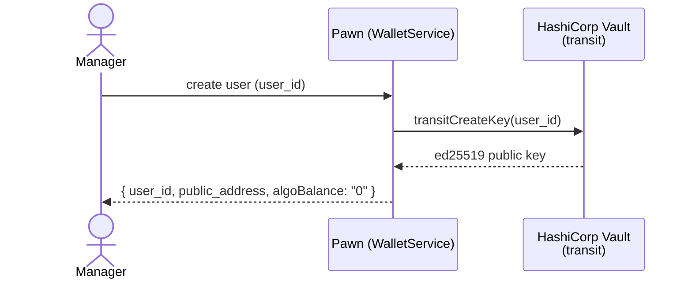
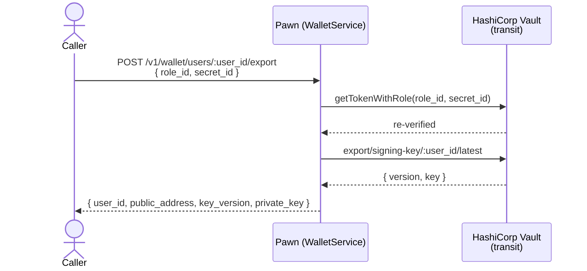
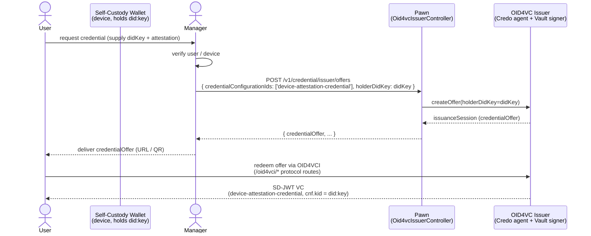
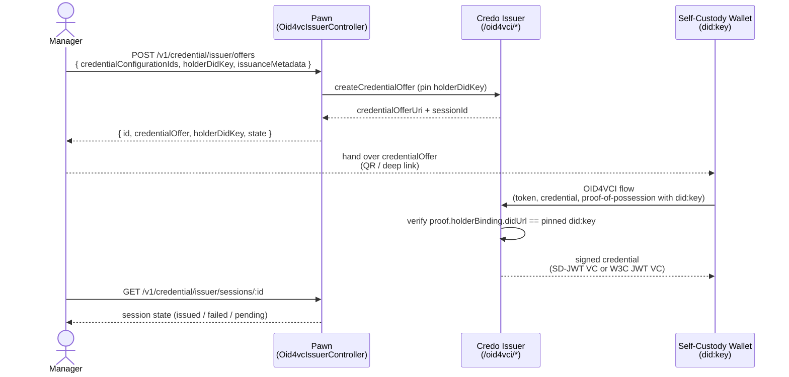
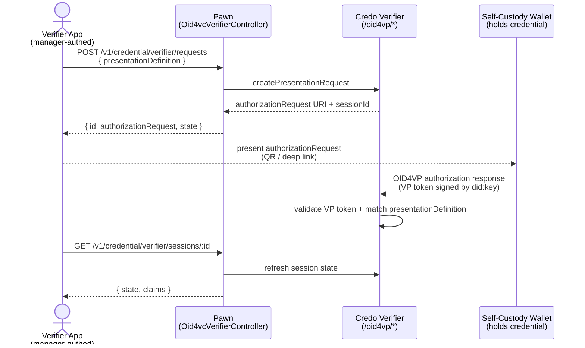
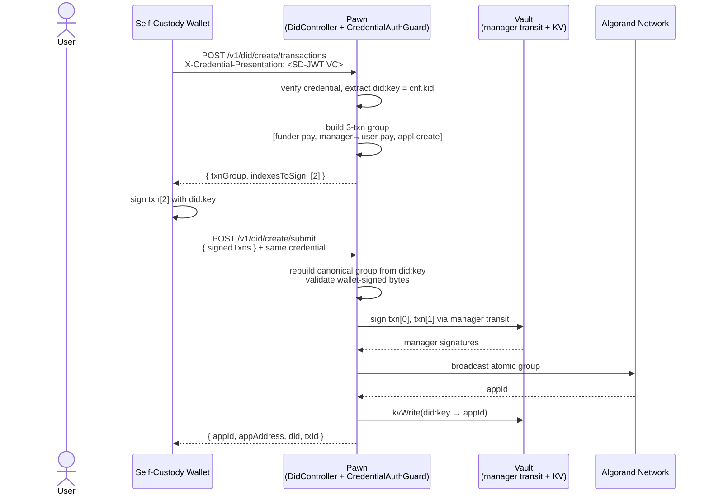
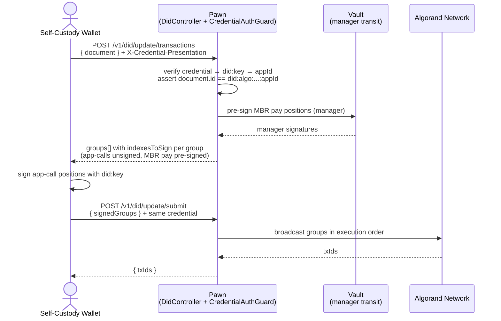
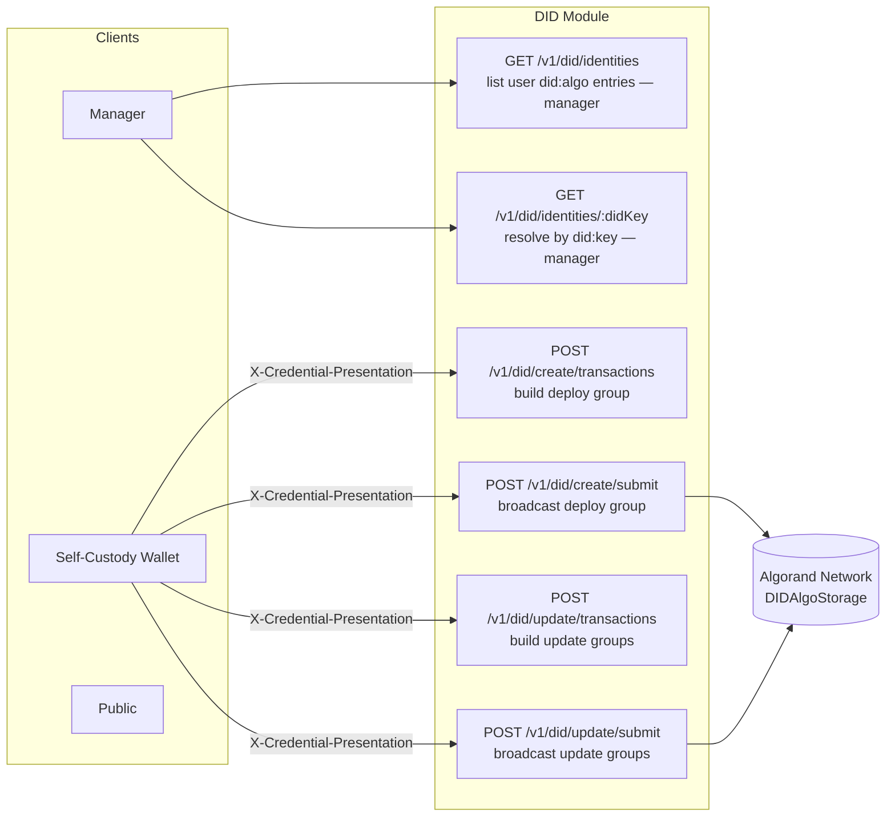

# DID + OID4VC Flows

High-level overview of the `did:algo` and OID4VC flows in this service.

The service exposes three logical surfaces:

- **`/v1/did/*`** — per-user `did:algo` contract deploy + document update,
  driven by the wallet itself and gated by a device-attestation credential.
- **Manager-issued credentials** — pre-authorized OID4VCI offers created by the 
  manager (optionally after device attestation) to mint credentials.
- **`/v1/credential/{issuer,verifier}/*`** — generic OID4VCI / OID4VP
  orchestration over a Credo agent. Credo's own protocol routes are
  mounted under `/oid4vci` and `/oid4vp` (outside the `/v1` prefix).

## 1. Deploy `DIDAlgoStorage` to a network

> [!NOTE]
> Prerequisite for everything else. The deployed app id is recorded as
> `DID_ALGO_APP_ID` and reused for every per-user contract template.

## 2. Provision a user (Vault key only)

> [!NOTE]
> - `WalletService.userCreate` now only provisions a **Vault transit
>   Ed25519 key** for the user and returns its derived Algorand address.
> - **No DID is published at user creation.** The user's `did:algo` is
>   deployed later by the wallet itself (section 5), owned by the
>   wallet-local `did:key` rather than by the manager.

## 2a. Export a user's private key (self-custody export)

> [!NOTE]
> - Only keys created with Vault's `exportable: true` /
>   `allow_plaintext_backup: true` flags (set on `transitCreateKey`)
>   can be exported. This flag cannot be applied retroactively to
>   existing keys.
> - As a confirmation step, the caller re-submits a valid Vault AppRole
>   `role_id`/`secret_id` pair, which is re-verified against Vault
>   before the key is exported.
> - The exported `private_key` is the raw ed25519 key material
>   (base64-encoded) — once returned, Vault can no longer protect it.

## 3. Manager-issued pre-authorized credential

> [!NOTE]
> - The wallet holds a local `did:key` (never leaves the device). 
> - The manager performs any required out-of-band verification (e.g. 
>   device attestation, KYC, or email proof) and then issues a 
>   **pre-authorized OID4VCI offer** pinned to the user's `did:key`.
> - The default credential configuration is `device-attestation-credential`,
>   which is what the `CredentialAuthGuard` expects by default.
> - No on-chain operations occur in this flow.

## 4. Generic OID4VC issuance & verification

> [!NOTE]
> - App-level endpoints under `/v1/credential/{issuer,verifier}/*` are
>   manager-authenticated (`Authorization: Bearer <manager-JWT>`).
>   They orchestrate session lifecycle; the wallet talks to the
>   protocol routes that Credo mounts directly under `/oid4vci` and
>   `/oid4vp`.
> - The issuer DID is the **manager's `did:algo`** (anchored on
>   Algorand and discoverable on-chain). Holder binding pins the
>   target wallet's `did:key` into the offer at creation time.
> - Section 3 is the canonical example of issuance — this flow is the
>   generalised shape (any credential configuration).

### 4a. Issue a credential (OID4VCI)

### 4b. Verify a presentation (OID4VP)

## 5. Wallet self-deploys its own `did:algo`

> [!NOTE]
> - Gated by `CredentialAuthGuard`: the wallet presents the
>   `device-attestation-credential` from section 3 in
>   `X-Credential-Presentation`. The credential's `cnf.kid` is the
>   `did:key` that will own the new contract — callers cannot spoof
>   a different owner.
> - The host **builds** the atomic group but **does not sign the
>   `applicationCreate`**: the wallet signs position 2 with its
>   `did:key`, which makes the wallet's address the on-chain
>   contract creator. The host signs positions 0 + 1 (manager-funded
>   `pay` txns) only at submit time, after byte-for-byte
>   revalidation of the wallet-signed bytes.
> - On confirmation, the new app id is persisted to Vault KV
>   (`did:key → appId`) and the canonical `did:algo:<network>:<appId>`
>   is returned.

## 6. Wallet updates its own DID document

> [!NOTE]
> - Same `CredentialAuthGuard` gate as section 5 — the credential-bound
>   `did:key` selects which per-user `DIDAlgoStorage` contract is
>   mutated, and the supplied document's `id` must equal the canonical
>   `did:algo:<network>:<appId>` derived from that key.
> - The host returns a flat list of 16-txn-packed atomic groups
>   covering the full swap (`startDelete`, `deleteData×N`,
>   `mbrPay + startUpload`, `upload×K`, `finishUpload`). The MBR `pay`
>   is pre-signed by the manager via Vault Transit; every app-call
>   is left unsigned for the wallet to sign with its `did:key`.
> - The on-chain contract refunds the prior box MBR via inner txns,
>   so the wallet pays only the net MBR delta.

## 7. DID module orchestration endpoints

> [!NOTE]
> - Manager-authenticated read endpoints for inspecting the per-user
>   DID registry. The public resolver lets any caller resolve a
>   cached document by `did:key`.

